# Introduction

Soccer is a team sport that include multiple roles for players such as goalkeeper, defender, midfielder, and striker. Each position also requires different physical abilities and skills to perform their duties effectively. For example, a striker is responsible for scoring goals and requires better attributes on pace, shooting, and attacking positioning. On the other hand, a defender needs to stop opposing teams' attacks and requires attributes such as tackling, marking, and interceptions. Seeking ways to gain a competitive edge, the use of data analytic techniques to fit and predict a player’s possible performances is an emerging trend in soccer. For instance, the German national team utilized data analytics to inform their training and match strategies, which led to their success in the 2014 World Cup.

In this research, the classification of players into strikers or defenders based on their physical attributes and skills is performed, which is crucial in player recruitment, team formation planning, and match strategy development. For instance, a team may use this analysis to recruit a striker who fits their attacking style and has a high probability of scoring goals. Additionally, coaches can use this analysis to develop a formation that maximizes the strengths of their players and neutralizes the opposition's strengths. Therefore, we need a quick way to judge whether a player should be placed in an attacking position or at a defending position on the field given some physical data such as max speed, passing ability, dribbling skills, and pace that could be quantified and measured for each player. Also, in modern soccer, the role of whether a defending player should act as a traditional back (LB / RB) or as a modern wing back (LWB / RWB), which would require more attacking abilities, is getting more important, as teams are seeking a way to break through the traditional tactics. This research also analyzes on how should we determine whether a player is better as back or wing back in this game, given the physical quantified data. 

We also conducted a regression analysis on the FIFA20 dataset to explore the relationship between a player's physical attributes and skills and their overall rating. Our analysis aims to provide insights into which physical attributes and skills are most important in determining a player's overall rating and how they are related to the player's preferred position. This information is essential for player recruitment, team formation planning, and match strategy development in the game, as it can help coaches and managers identify the most valuable players for their team and create a strategy that maximizes their chances of success on the field. In the following sections, we will describe our methodology and results and discuss the implications of our findings for the game of FIFA20.


# Statistical Methods

## Data description

The original FIFA20 dataset is obtained from Kaggle (FIFA 20 Complete Player Dataset, n.d.). This dataset contains FIFA20 player data. We pre-process the dataset with python to only obtain the data columns that we want to use in this final project and removed all data of Goalkeepers, which has a different record form than other players. The updated dataset (Players_20_edited.csv, 2023) contains 16242 non-goalkeeper soccer players and their physical data, scores on skills, and positions.


## Classification Method

We used Support Vector Machines (SVM) as the main statistical method to classify whether a player is better to play as a striker or as a defender on the field. SVM is a well-established method for classification, which has been used in many fields, including image recognition, bioinformatics, and finance (Cortes & Vapnik, 1995; Cristianini & Shawe-Taylor, 2000). We selected the SVM method because it can effectively deal with high-dimensional data, and it is capable of finding nonlinear decision boundaries (Hsu & Lin, 2002). 

In the two classifications, we applied simple Linear SVM, tuned Linear SVM, Radial Kernel SVM, and Polynomial Kernel SVM and compares in their effects of classification for the training data and k-fold cross validation is applied during training to prevent overfitting of the model and provide a more accurate estimate of the model's performance on unseen data. (Hastie et al., 2001)


## Regression Method

We performed linear regression to find the relationship between a play’s overall score and different attributes. Linear regression is a statistical method used to model the relationship between a dependent variable and one or more independent variables. The goal of linear regression is to find the equation of a straight line that best fits the data. This line can then be used to make predictions about the dependent variable based on values of the independent variable(s). (Hastie et al., 2001)

Also, we used logistic regression to analysis the overall score versus the age of the player. Logistic regression is a statistical method used to model the relationship between a binary dependent variable and one or more independent variables. The goal of logistic regression is to find the best-fitting equation that predicts the probability of the dependent variable being in one of the two categories. (Hastie et al., 2001)


## Variable Selection method

We applied variable selection method (best subset selection and BIC) to improve the accuracy of model predictions. Best subset selection is a statistical method used to identify the best combination of predictor variables in a regression model. The method involves fitting all possible models with all possible subsets of predictor variables and choosing the one that has the best performance according to a chosen criterion, such as the R-squared value. The Bayesian Information Criterion (BIC) is a statistical criterion used to select the best subset of variables in a model. It is a measure of the goodness of fit of a model and takes into account the number of parameters in the model. BIC penalizes models with more parameters, which can help prevent overfitting. The model with the lowest BIC value is selected as the best model. (Hastie et al., 2001)


# Results

## Classification – Striker vs Defender

In this classification task, we try to train a classifier that classifies a player to be Striker (ST) or Center Back (CB). There are 7835 players for CB and 8407 players for ST in the whole dataset. After splitting the dataset into a Training set and a Testing set with ratio 8:2, we also tested the performance of the models with some famous players deliberately picked out to show the accuracy of the models. The famous players include three STs, three CBs, LW, RW, LB, RB, and several midfield players. 

### Simple Linear SVM
In this part, we fit a Simple Linear SVM (Cost = 1) on the training data and train with 10-fold cross-validation. The training results in an accuracy of 0.9938. Table 1 below shows the statistics of testing on Test Set and Famous Players.

**Table 1**  
*Test Results on Simple Linear SVM (Cost = 1)*
```{r, echo=FALSE, out.width='80%', fig.align='center'}

```

### Tuned Linear SVM
In this part, we tune a Linear SVM on the training data with the Cost and train with 10-fold cross-validation. The training picks a best Cost of 0.75 with accuracy of 0.9944. Figure 1 below shows the tuning curve with each cost values. below shows the statistics of testing on Test Set and Famous Players.   

**Figure 1**  
*Tune Results of Linear SVM on Training Set*
```{r, echo=FALSE, out.width='70%', out.height='70%', fig.align='center'}
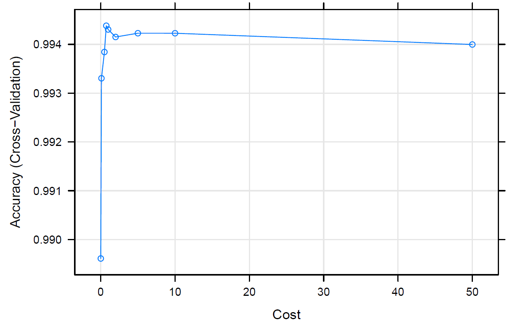
```

**Table 2**  
*Test Results on Tuned Linear SVM (Cost = 0.75)*
```{r, echo=FALSE, out.width='80%', fig.align='center'}

```

### Radial SVM

In this part, we train a Radial Kernel SVM on the training data and train with 10-fold cross-validation. The training picks a best Cost of 32 with accuracy of 0.9900. Figure 2 below shows the tuning curve with each cost values. Table 3 below shows the statistics of testing on Test Set and Famous Players.   

**Figure 2**  
*Tune Results of Radial SVM on Training Set*
```{r, echo=FALSE, out.width='70%', out.height='70%', fig.align='center'}
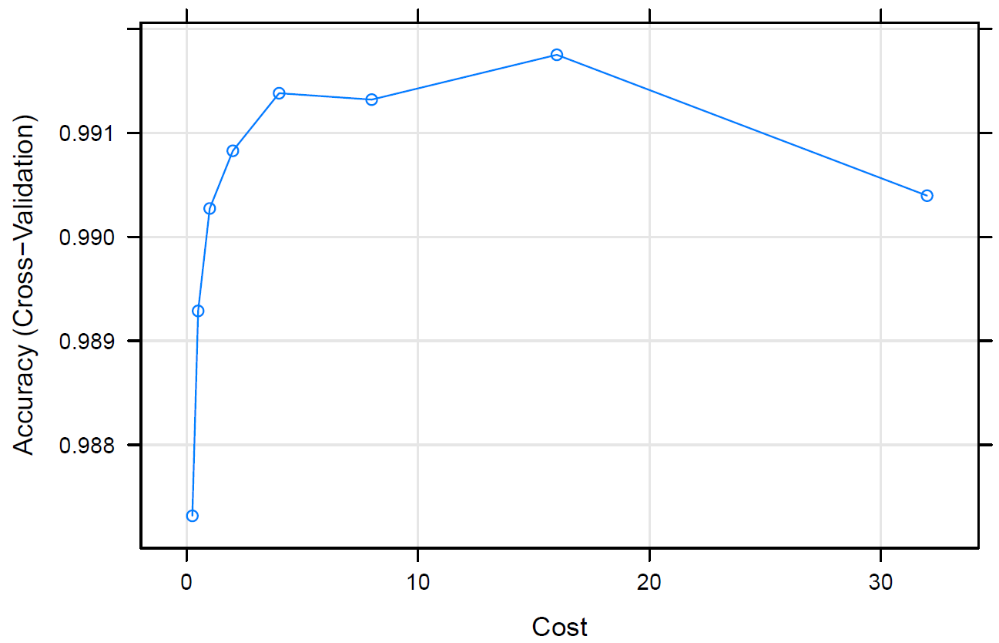
```

**Table 3**  
*Test Results on Tuned Radial Kernel SVM (Cost = 32)*
```{r, echo=FALSE, out.width='80%', fig.align='center'}

```

### Polynomial SVM
In this part, we train a Polynomial Kernel SVM on the training data and train with 10-fold cross-validation. Figure 3 below shows the tuning curve with each cost and scale. Table 4 below shows the statistics of testing on Test Set and Famous Players.   

**Figure 3**  
*Tune Results of Polynomial SVM on Training Set*
```{r, echo=FALSE, out.width='70%', out.height='70%', fig.align='center'}
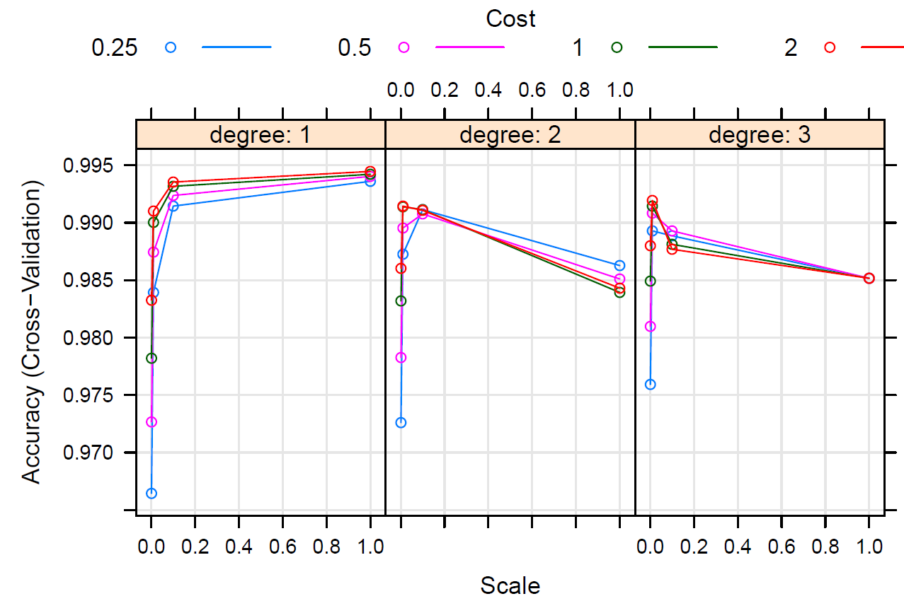
```

**Table 4**  
*Test Results on Tuned Polynomial Kernel SVM*
```{r, echo=FALSE, out.width='80%', fig.align='center'}
knitr::include_graphics("figures/Table 4.png")
```

### Report
Based on the training performances and test results, we choose to go with the Radial Kernel SVM to classify on the position of a player.  

## Classification – Back vs Wing Back

In this classification task, we try to train a classifier that classifies a player to be traditional Back (LB/RB) or modern Wing Back (LWB/RWB). There are 12492 players better as LWB/RWB and 3750 players for LB/RB in the whole dataset.

**Table 5**  
*Test Results on Test Set*
```{r, echo=FALSE, out.width='80%', fig.align='center'}
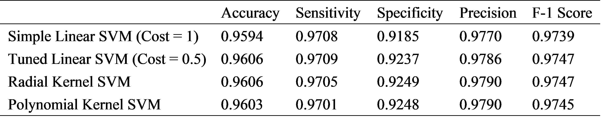
```

### Simple Linear SVM

In this part, we fit a Simple Linear SVM (Cost = 1) on the training data and train with 10-fold cross-validation. The training results in an accuracy of 0.9609. Table 5 shows the statistics of testing on Test Set.   

### Tuned Linear SVM

In this part, we tune a Linear SVM on the training data with the Cost and train with 10-fold cross-validation. The training picks a best Cost of 0.5 with accuracy of 0.9623. Figure 4 shows the tuning curve with each cost values. Table 5 shows the statistics of testing on Test Set.  

**Figure 4**  
*Tune Results of Linear SVM on Training Set*
```{r, echo=FALSE, out.width='70%', out.height='70%', fig.align='center'}
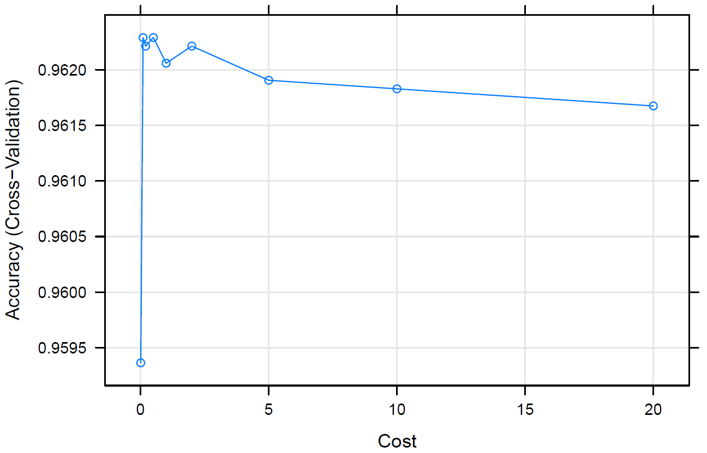
```

### Radial SVM

In this part, we train a Radial Kernel SVM on the training data and train with 10-fold cross-validation. The training picks a best Cost of 8 with accuracy of 0.9580. Figure 5 shows the tuning curve with each cost values. Table 5 shows the statistics of testing on Test Set.   

**Figure 5**  
*Tune Results of Radial SVM on Training Set*
```{r, echo=FALSE, out.width='70%', out.height='70%', fig.align='center'}
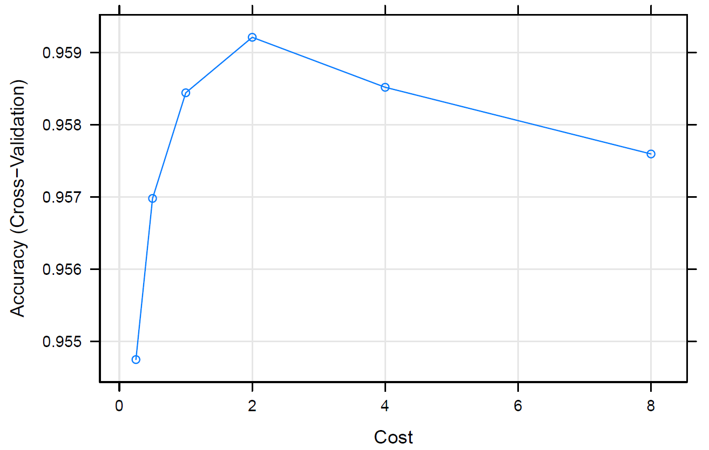
```

### Polynomial SVM

In this part, we train a Polynomial Kernel SVM on the training data and train with 10-fold cross-validation. Figure 6 shows the tuning curve with each cost and scale. Table 5 shows the statistics of testing on Test Set.   

**Figure 6**  
*Tune Results of Polynomial SVM on Training Set*
```{r, echo=FALSE, out.width='70%', out.height='70%', fig.align='center'}
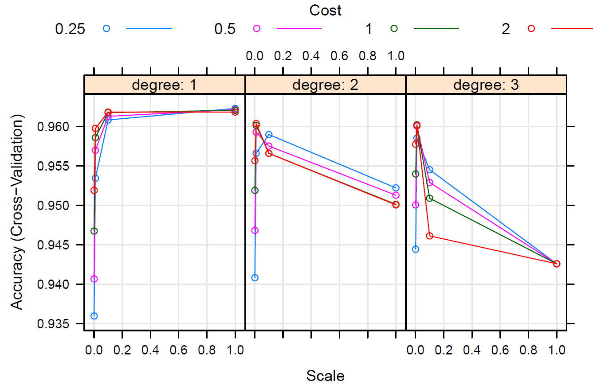
```

### Report

Based on the training performances and test results, we choose to go with the Radial Kernel SVM to classify on the position of a player. Though the accuracy of Tuned Linear SVM and Radial Kernel SVM are basically the same, we should still go with Radial Kernel SVM as it provide us with better interpretation on high-dimensional data, such as the FIFA dataset.  

## Regression – Overall vs Selected Attributes

In this regression task, we try to find a linear model that predicts the player’s overall score based on the attributes chosen by the variable selection method.

### Best Subset Selection
In this part, we perform the best subset selection on the estimation data and choose the best model based on Cp criteria. The final model we choose has the lowest Cp value 18.84663. The validation error is 5.641129. The Figure 7 shows the Cp value with each model size. 

**Figure 7**  
*[Some Descriptions of Fig 7]*
```{r, echo=FALSE, out.width='70%', out.height='70%', fig.align='center'}
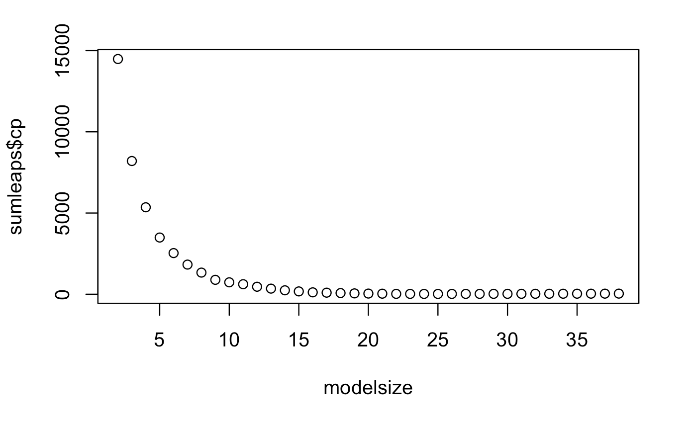
```

### Backward Selection
In this part, we perform the backward selection on the estimation data and choose the best model based on BIC criteria. The final model we choose has the lowest BIC value 22937.16. The validation error is 5.637853. 

**Figure 8**  
*[Some Descriptions of Fig 8]*
```{r, echo=FALSE, out.width='70%', out.height='70%', fig.align='center'}
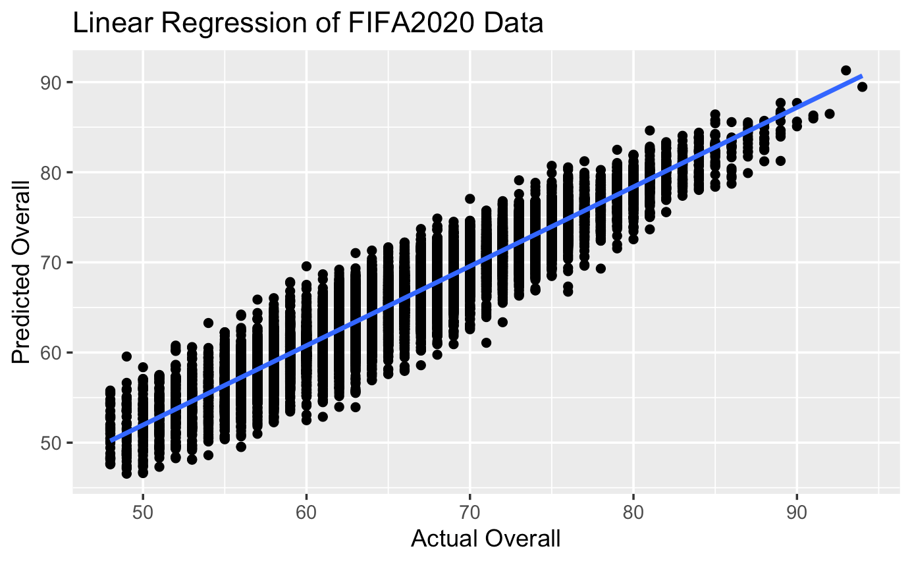
```

### Report
Thus, we choose Backward Selection since it has lower validation error. We then use the model to fit the training data and test data, which gives the training MSE 5.615927 and test MSE 5.330194. The Figure 8 shows the predicted overall score vs. actual overall score of FIFA2020 data.  

## Regression – Overall vs Age

In this regression task, we try to find the relationship of the player’s overall score and age. First, we will bin the player values and name the new column as Value Brackets with the labels: 0–10M, 10–20M, 20–30M, 30–40M, 40–50M, 50–60M, 60–70M, 70–80M, 80–90M, 90–100M, 100M+. Figure 9 shows the age and overall rating of players based on the value bracket.

**Figure 9**  
*[Some Descriptions of Fig 9]*
```{r, echo=FALSE, out.width='70%', out.height='70%', fig.align='center'}
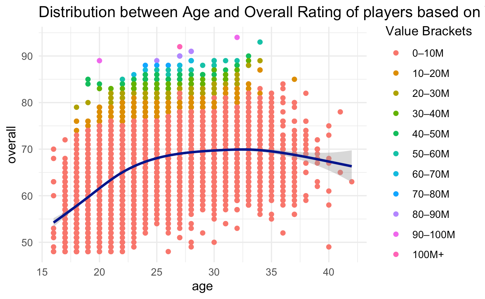
```

We see that the high valuations are dominated by players of overall rating 75+ and age between 23 to 33 years.  

Now, we will perform logistic regression analysis to find the relationship between Overall and Age. We set a threshold of 75, where players with an overall rating of 75 or higher will be classified as "good" (1), and players with an overall rating below 75 will be classified as "not good" (0). Figure 10 shows the fit of the logistic regression model.  

**Figure 10**  
*[Some Descriptions of Fig 10]*
```{r, echo=FALSE, out.width='70%', out.height='70%', fig.align='center'}
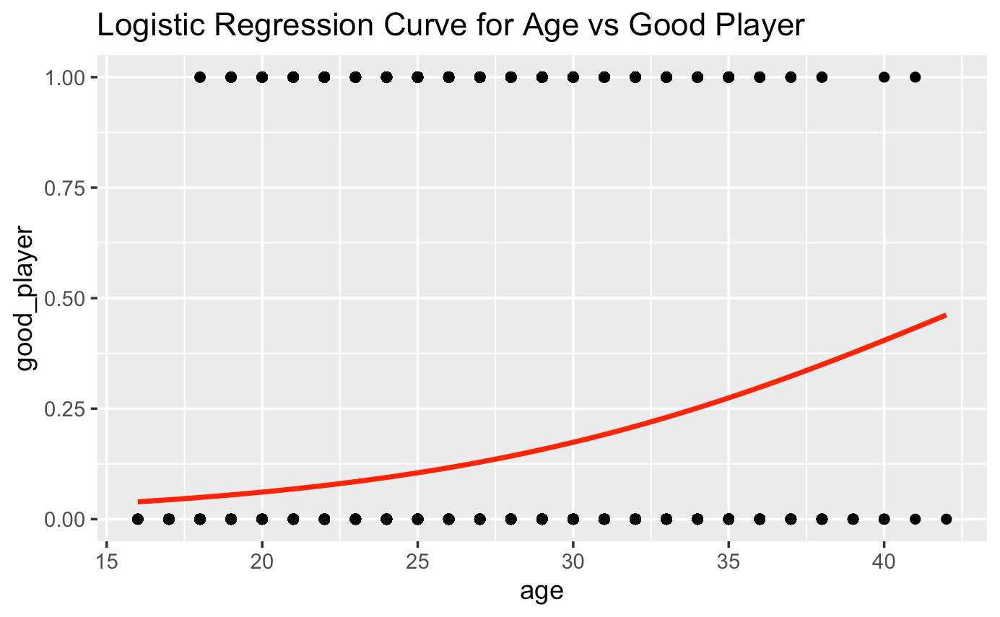
```

# Discussion
## Classification
From the results of the two classifications, we both choose Radial Kernel SVM as the final classifier, and they both achieve a good performance on the test set. Radial Kernel SVM can capture non-linear relationships between the features and the target variable. It’s also effective with high-dimensional data like the FIFA dataset, while it is robust to noise. Therefore, it’s theoretically and practically right to use a Radial Kernel SVM.   

One problem we need to fix in future researches is that we directly train the classifiers on all feature variables, which could lead to overfitting. In the later researches, we might apply variable selection methods such as Lasso or BIC selection before the actual training of models. Other details that might be improved includes a theoretical derivation of to what extent should we tune the parameters so that it’s both mathematically make sense and doesn’t take a lot of computations to run. This would make the training faster and more accurate.  

## Regression
Based on the regression analysis of the FIFA20 dataset, we have found that backward selection method provides a better fit for predicting the overall score of a player based on selected attributes. The model resulted in a lower validation error and lower MSE values for both training and test data. This indicates that the selected attributes have a strong impact on the overall score of a player in the FIFA game.  

Additionally, the logistic regression analysis between the overall score and age showed that players with an overall rating of 75 or higher are more likely to be classified as "good" if their age is between 23 to 33 years. This finding suggests that age is an important factor in determining the quality of a player in the game.  

However, future research should consider variable selection methods such as Lasso or Ridge to prevent overfitting and improve the accuracy of the models. Additionally, further work is needed to determine optimal parameter tuning to speed up computations and make the training process more efficient. Overall, the regression analysis on the FIFA20 dataset provided valuable insights into the factors that contribute to the overall score of a player in the game, and the effective methods for predicting it.  


\newpage

# References
Bauer, E., & Kohavi, R. (1999). Machine Learning, 36(1/2), 105–139. https://doi.org/10.1023/a:1007515423169 

Cortes, C., & Vapnik, V. (1995). Support-vector networks. Machine Learning, 20(3), 273–297. https://doi.org/10.1007/bf00994018

Cristianini, N., & Shawe-Taylor, J. (2000). An Introduction to Support Vector Machines and Other Kernel-based Learning Methods. https://doi.org/10.1017/cbo9780511801389 

Chih-Wei Hsu, & Chih-Jen Lin. (2002). A comparison of methods for multiclass support vector machines. IEEE Transactions on Neural Networks, 13(2), 415–425. https://doi.org/10.1109/72.991427 

FIFA 20 complete player dataset. (n.d.). Www.kaggle.com. Retrieved May 6, 2023, from https://www.kaggle.com/datasets/stefanoleone992/fifa-20-complete-player-dataset?resource=download&select=players_20.csv 

Hastie, T., Friedman, J., & Tibshirani, R. (2001). The Elements of Statistical Learning : Data Mining, Inference, and Prediction. Springer. 

players_20_edited.cs Retrieved May 6, 2023, from https://uofi.app.box.com/s/91m9qt18v7zhxh00d18edv7fx6x95fsw 

